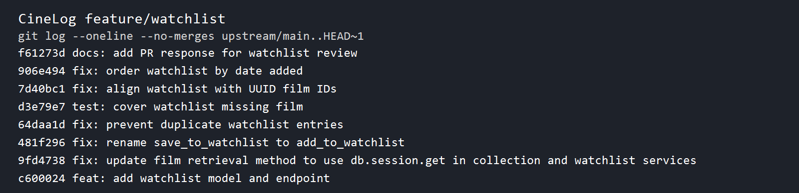

# PR Response Doc — CineLog Watchlist Feature

## AI Usage

I used AI only to query course and repository reference material for the following milestones:

- **Milestone 1:** queried the Show requirements, the CineLog file roles, and the existing collection-service and test patterns.
- **Milestone 2:** queried the review requirements for Comments 1–3 and the corresponding rename, deduplication, and missing-ID test locations.
- **Milestone 3:** queried the UUID refactor/rebase context and the course material describing the two design discussions in Comments 4 and 5.
- **Milestone 4:** queried the Conventional Commits and final submission checklist requirements.

I wrote the implementation, design decisions, tests, rebase result, and final history verification myself.

## Comment 1 — Rename

**What I did:**

Renamed `save_to_watchlist()` to `add_to_watchlist()` in `services/watchlist_service.py` and updated the import and call site in `routes/watchlist/watchlist.py`. This follows CineLog's `verb_to_noun` naming convention used by `add_to_collection()` and `remove_from_collection()`.

**How I verified:**

I searched the repository for `save_to_watchlist` and confirmed there were no remaining references. The full test suite passed after the rename.

## Comment 2 — Deduplication

**What I did:**

Added `AlreadyInWatchlistError` and an existence check in `add_to_watchlist()`. The service now checks `user_id` and `film_id` before creating a `WatchlistEntry`, matching the existing `add_to_collection()` pattern. The route translates this error to HTTP 409 instead of creating a duplicate row.

**How I verified:**

`tests/test_watchlist.py::test_add_to_watchlist_duplicate_raises` adds the same film twice, asserts that `AlreadyInWatchlistError` is raised, and confirms that only one database row exists.

## Comment 3 — Missing test

**What I did:**

Created `tests/test_watchlist.py` with happy-path, duplicate, and nonexistent-film coverage. The requested missing-ID case is `test_add_to_watchlist_nonexistent_film_raises`, which passes a UUID that is not present and expects `FilmNotFoundError` rather than a database integrity error.

**How I verified:**

Ran the full suite with `python -m pytest tests/ -v`. The final result was **8 passed**.

## Comment 4 — Default visibility

**My position:**

Keep `public=True` as the default for a new watchlist entry.

**Reasoning:**

CineLog is a community film-tracking app, so discoverability is part of the value of a watchlist. A public-by-default list lets other users discover films someone is planning to watch without requiring an extra setting for the common social use case. The existing `public` field already expresses this visibility decision at the entry level, so the default should be explicit rather than accidental.

**Tradeoff acknowledged:**

Public-by-default can expose a user's intentions to people who expected a private list. Privacy-sensitive users should be able to avoid that behavior once the API exposes an explicit visibility parameter; if the product later chooses private-by-default, that should be a deliberate product and migration decision rather than an unreviewed code default.

## Comment 5 — Sort order

**My position:**

Use `date_added` descending order, so the newest watchlist additions appear first.

**Reasoning:**

A watchlist is usually a queue of films a user recently decided to watch. Showing the newest additions first makes the list useful for the user's current watch-planning workflow and matches the maintainer's stated preference. `services/watchlist_service.py::get_watchlist()` now orders by `WatchlistEntry.date_added.desc()`.

**Engagement with reviewer's point:**

Alphabetical order is deterministic and can help users scan for a known title, but it hides the time-based intent behind a watchlist and makes recently added films harder to find. I chose the maintainer's date-added preference and added `test_get_watchlist_returns_newest_first` to pin the behavior.

## Comment 6 — Rebase

**What conflicted:**

The `feature/watchlist` work was written against the pre-refactor model where `Film.id` and watchlist `film_id` were integers. `main` had migrated film IDs and collection foreign keys to UUID strings.

**How I resolved it:**

I ran `git rebase upstream/main`. Git did not leave textual conflict markers, but the rebase exposed the semantic conflict: the post-rebase `models.py` did not retain the watchlist model. I restored `WatchlistEntry` in a UUID-compatible form, including a UUID foreign key and the same per-user/per-film uniqueness rule as the collection model. I also updated the watchlist route and service documentation to use UUIDs and kept `db.session.get(Film, film_id)` as the lookup path.

**How I verified no conflict remains:**

The working tree is clean, `git diff --check` reports no whitespace errors, the full pytest suite passes with 8 tests, and `git log --merges upstream/main..HEAD` returns no merge commits. The feature-only history is shown below.



## PR Description

This PR adds a CineLog watchlist model, service functions, and REST endpoints. Users can add a UUID-based film to their watchlist, retrieve the list, and receive clear 404/409 responses for missing films and duplicate entries. The implementation follows the existing collection patterns and preserves one watchlist entry per user and film.

The two design decisions are public-by-default visibility and newest-first `date_added` ordering. Public visibility supports CineLog's community discovery use case, with privacy acknowledged as the tradeoff. Date-added ordering keeps the user's most recent watchlist decisions visible first.

### Manual testing

1. Install dependencies and run the tests:

   ```powershell
   python -m venv .venv
   .\.venv\Scripts\Activate.ps1
   pip install -r requirements.txt
   python -m pytest tests/ -v
   ```

2. Start the API with `python app.py`.

3. In a second terminal, create a test user and film in the same SQLite database and copy the returned UUIDs:

   ```powershell
   python -c "from app import create_app,db; from models import User,Film; app=create_app(); ctx=app.app_context(); ctx.push(); user=User(username='manual-user',email='manual@example.com'); film=Film(title='Arrival'); db.session.add_all([user,film]); db.session.commit(); print(f'USER_ID={user.id} FILM_ID={film.id}')"
   ```

4. Use those UUIDs in these requests:

   ```powershell
   curl.exe -X POST http://127.0.0.1:5000/watchlist/USER_ID/add `
     -H "Content-Type: application/json" `
     -d '{"film_id":"FILM_ID"}'

   curl.exe http://127.0.0.1:5000/watchlist/USER_ID

   # The same film again should return 409.
   curl.exe -X POST http://127.0.0.1:5000/watchlist/USER_ID/add `
     -H "Content-Type: application/json" `
     -d '{"film_id":"FILM_ID"}'

   # A UUID that is not in the films table should return 404.
   curl.exe -X POST http://127.0.0.1:5000/watchlist/USER_ID/add `
     -H "Content-Type: application/json" `
     -d '{"film_id":"00000000-0000-0000-0000-000000000000"}'
   ```

The final feature branch contains separate conventional commits for the watchlist feature, UUID alignment, rename, deduplication, tests, and date-added ordering. It is based on the updated `main` branch and contains no merge commits in the feature branch range.
